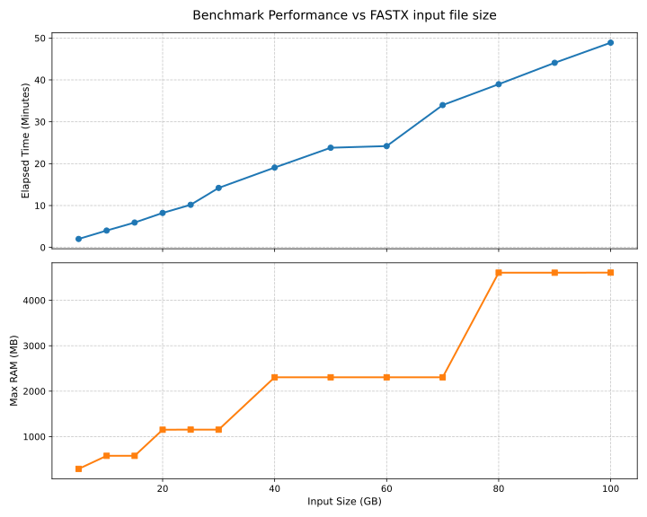

[](https://pixi.sh)

# FDedup

FDedup (FastDedup) is a fast and memory-efficient FASTX PCR deduplication tool written in Rust. It utilizes [needletail](https://github.com/onecodex/needletail) for high-performance sequence parsing, [xxh3](https://github.com/DoumanAsh/xxhash-rust) for rapid hashing, and [fxhash](https://github.com/cbreeden/fxhash) for a low-overhead memory cache.

## Features

- **Fast & Memory Efficient**: Uses zero-allocation sequence parsing and a non-cryptographic high-speed hashing cache, which automatically scales based on the estimated input file size.
- **Supports Compressed Formats**: Transparently reads and writes both uncompressed and GZIP compressed (`.gz`) FASTQ/FASTA files.
- **Incremental Deduplication & Auto-Recovery**: By default, FDedup appends new sequences to an existing output file. It safely pre-loads existing hashes to prevent duplicates. If an uncompressed output file is corrupted due to a previous crash, FDedup automatically truncates it to the last valid sequence and resumes safely.
- **Workflow Ready**: Includes a `pixi.toml` file with tasks supporting simulated genome generation, deduplication benching, and FastQC/MultiQC reporting.
- **Profiling Built-in**: Easy memory and execution profiling tasks available via `samply`.


> This was made on an HPC () with SLURM. I allocated 6 cores of an AMD EPYC™ 9654 and 32Go of RAM.
> I will add the comparaison between FDedup and other tools like [Clumpify](https://github.com/BioInfoTools/BBMap/blob/master/sh/clumpify.sh), [FastUniq](https://github.com/alces-software/packager-base/blob/master/apps/fastuniq/1.1/fastuniq.sh.md) and [fastp](https://github.com/OpenGene/fastp.git)

## Requirements

- [Rust](https://rustup.rs/) (>= 1.93)
- [Pixi](https://pixi.sh) (Optional, for running workflows and benchmarks)

## Usage

```bash
fdedup <input_file> [output_file] [--force] [--verbose|-v] [--dryrun|-d]
```

- `<input_file>`: Path to the input FASTA/FASTQ/GZ file.
- `[output_file]`: Path to the output file (optional). Defaults to `output.fastq.gz`.
- `--force`: Overwrite the output file if it exists (instead of pre-loading hashes and appending).
- `--verbose` or `-v`: Print processing stats, such as execution time, number of sequences, and duplication rates.
- `--dryrun` or `-d`: Calculate duplication rate without creating an output file.
  singularity run fdedup.sif fdedup

### Run it from Cargo

You can run it directly from Cargo:

```bash
cargo run --release -- <input_file> [output_file] [--force] [--verbose|-v] [--dryrun|-d]
```

### Run with Pixi

You can also rely on Pixi to run:

```bash
pixi run cargo build --release
pixi run fdedup <input_file> [output_file] [--force] [--verbose|-v] [--dryrun|-d]
```

### Run with Singularity / Apptainer

> Note: for now, you have to make the image yourself, but I added a task to make it more easily.
> You need to install [pixitainer](https://github.com/RaphaelRibes/pixitainer) to run this command.
> 
> ```shell
> pixi global install -c https://prefix.dev/raphaelribes -c https://prefix.dev/conda-forge pixitainer
> ```

You can build a Singularity/Apptainer image using the provided the command:
```shell
pixi run cargo build --release
pixi run containerize
```
> Note: by default, this command will use the binary built on your computer and put it in a apptainer container with by default `ubuntu:24.04`.
> If it is not your current os, I recommend you add the `-b/--base-image` option to specify the base image you want to use for the container.

Then, you can run the container with:
```bash
apptainer run fdedup.sif fdedup <input_file> [output_file] [--force] [--verbose|-v] [--dryrun|-d]
```

> Note: `--force` is very slow when used in a Singularity container. We recommend just deleting the output file before running the container if you want to start from scratch.

## Recommendations

If you are using FDedup in a pre-processing step, we recommend you to not export your file to a `.gz` format.
If there is any crash, FDedup cannot restart from a compressed file, and you will lose all the progress.
It is because a corrupted gzipped flux will make the file unreadable, and you will have to start from scratch using `--force`.
However, if you output to an uncompressed format, FDedup will automatically detect any crash-induced corruption, safely truncate the file to the last valid sequence, and seamlessly resume deduplication.

## To-Do List

- [ ] Support for **Paired-End read deduplication**.
- [ ] Add **Multithreading** to parallelize sequence hashing and processing.
- [ ] Support tracking sequence **abundances** (counts) instead of naive discarding.
- [ ] Add an option for exporting sequences as **FASTA**.
- [ ] Maintain paired qualities correctly for more complex file conversions.
- [ ] Improve error handling.

## License

This project is licensed under the MIT License. See the [LICENSE](Licence) file for details.

## Author

[Raphaël Ribes](https://www.raphaelrib.es)

[Céline Mandier](https://gitlab.in2p3.fr/celine.mandier1)

# Acknowledgements
Computations were performed on the ISDM-MESO HPC platform, funded in the framework of State-region planning contracts (Contrat de plan État-région – CPER) by the French Government, the Occitanie/Pyrénées-Méditerranée Region, Montpellier Méditerranée Métropole, and the University of Montpellier.
